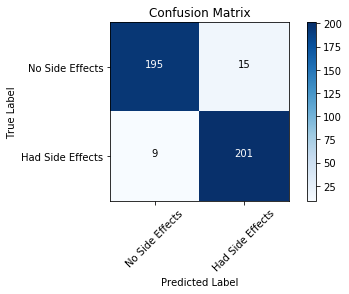

# Scenario Case
An experimental Drug was tested on 2100 patients, where half of the patients were under 65 years old and the other half over 65 years old.
Out of these patients 95% of the patients below 65 experienced no side effects

## Generate Data


```python
import numpy as np
from random import randint
from sklearn.preprocessing import MinMaxScaler
```
Generate the data using ```randint``` and store in both train_labels and train_samples


```python
for i in range(50):
    random_younger = randint(13, 64)
    train_samples.append(random_younger)
    train_labels.append(1)
    
    random_older = randint(65, 100)
    train_samples.append(random_older)
    train_labels.append(0)

for i in range(1000):
    random_younger = randint(13, 64)
    train_samples.append(random_younger)
    train_labels.append(0)
    
    random_older = randint(65, 100)
    train_samples.append(random_older)
    train_labels.append(1)
``

convert both train_labels and samples to arrays using numpy

```python
train_labels = np.array(train_labels)
train_samples = np.array(train_samples)
```


```python
scaler = MinMaxScaler(feature_range=(0,1))
scaled_train_samples = scaler.fit_transform((train_samples).reshape(-1,1))
```
```python
# Import keras, 
import keras
from keras import backend as K

# Building a sequential model
from keras.models import Sequential
from keras.layers import Activation
from keras.layers.core import Dense
from keras.optimizers import Adam
from keras.metrics import categorical_crossentropy, sparse_categorical_crossentropy
```
## Model
Building a sequential model with fully connected layers

```python
model = Sequential([
    Dense(16, input_shape=(1,), activation="relu"),
    Dense(32, activation="relu"),
    Dense(2, activation="softmax")
])
```

## Now Let's Check The Model Summary


```python
model.summary()
```

    _________________________________________________________________
    Layer (type)                 Output Shape              Param #   
    =================================================================
    dense_1 (Dense)              (None, 16)                32        
    _________________________________________________________________
    dense_2 (Dense)              (None, 32)                544       
    _________________________________________________________________
    dense_3 (Dense)              (None, 2)                 66        
    =================================================================
    Total params: 642
    Trainable params: 642
    Non-trainable params: 0
    _________________________________________________________________


# Compile the model first
```python
# Feel free to Experiment with different learning rates

model.compile(Adam(lr=.0001), loss="sparse_categorical_crossentropy", metrics=["accuracy"])
```


# Training with A Validation Set 
Given validation split, splits the data into a validation set with the given percentage.
In this case 10% percentage of the data is used for validation
```python
model.fit(scaled_train_samples,train_labels, validation_split=0.1, batch_size=10, epochs=20, shuffle=True, verbose=2)
```

    Train on 1890 samples, validate on 210 samples
    Epoch 1/20
     - 1s - loss: 0.6826 - acc: 0.5233 - val_loss: 0.6708 - val_acc: 0.5667
    Epoch 2/20
     - 0s - loss: 0.6645 - acc: 0.5683 - val_loss: 0.6487 - val_acc: 0.6476
    Epoch 3/20
     - 0s - loss: 0.6441 - acc: 0.6328 - val_loss: 0.6223 - val_acc: 0.7238
    Epoch 4/20
     - 1s - loss: 0.6202 - acc: 0.6825 - val_loss: 0.5943 - val_acc: 0.7571
    Epoch 5/20
     - 0s - loss: 0.5962 - acc: 0.7138 - val_loss: 0.5652 - val_acc: 0.7905
    Epoch 6/20
     - 1s - loss: 0.5715 - acc: 0.7497 - val_loss: 0.5366 - val_acc: 0.8286
    Epoch 7/20
     - 1s - loss: 0.5466 - acc: 0.7905 - val_loss: 0.5065 - val_acc: 0.8429
    Epoch 8/20
     - 0s - loss: 0.5217 - acc: 0.8032 - val_loss: 0.4778 - val_acc: 0.8524
    Epoch 9/20
     - 0s - loss: 0.4970 - acc: 0.8296 - val_loss: 0.4487 - val_acc: 0.8714
    Epoch 10/20
     - 0s - loss: 0.4731 - acc: 0.8492 - val_loss: 0.4206 - val_acc: 0.8857
    Epoch 11/20
     - 1s - loss: 0.4503 - acc: 0.8603 - val_loss: 0.3944 - val_acc: 0.8952
    Epoch 12/20
     - 0s - loss: 0.4290 - acc: 0.8704 - val_loss: 0.3692 - val_acc: 0.9190
    Epoch 13/20
     - 1s - loss: 0.4098 - acc: 0.8810 - val_loss: 0.3466 - val_acc: 0.9190
    Epoch 14/20
     - 1s - loss: 0.3927 - acc: 0.8857 - val_loss: 0.3264 - val_acc: 0.9238
    Epoch 15/20
     - 1s - loss: 0.3776 - acc: 0.8942 - val_loss: 0.3073 - val_acc: 0.9429
    Epoch 16/20
     - 1s - loss: 0.3642 - acc: 0.9016 - val_loss: 0.2905 - val_acc: 0.9429
    Epoch 17/20
     - 0s - loss: 0.3527 - acc: 0.9016 - val_loss: 0.2758 - val_acc: 0.9524
    Epoch 18/20
     - 1s - loss: 0.3426 - acc: 0.9069 - val_loss: 0.2624 - val_acc: 0.9667
    Epoch 19/20
     - 0s - loss: 0.3340 - acc: 0.9143 - val_loss: 0.2500 - val_acc: 0.9667
    Epoch 20/20
     - 0s - loss: 0.3266 - acc: 0.9175 - val_loss: 0.2396 - val_acc: 0.9667

## Running Predictions


```python
predictions = model.predict(scaled_test_samples, batch_size=10,verbose=1)
```

    420/420 [==============================] - 0s 345us/step


```python
# Let's Round the predictions by predicting the classes
rounded_predictions = model.predict_classes(scaled_test_samples, batch_size=10, verbose=2)
for i in rounded_predictions:
    print (i)
```

## Confusion Matrix

```python
%matplotlib inline
from sklearn.metrics import confusion_matrix
import itertools
import matplotlib.pyplot as plt
```
```python
cm = confusion_matrix(test_labels, rounded_predictions)
```

```python
'''
code got from scikit learn documentation
'''
def plot_confusion_matrix(cm, classes, normalize=False,title="Confusion Matrix", cmap=plt.cm.Blues):
    plt.imshow(cm, interpolation='nearest', cmap=cmap)
    plt.title(title)
    plt.colorbar()
    tick_marks = np.arange(len(classes))
    plt.xticks(tick_marks, classes, rotation=45)
    plt.yticks(tick_marks, classes)
    
    if normalize:
        cm = cm.astype('float') / cm.sum(axis=1)[:, np.newaxis]
        print('Normalized Confusion Matrix')
    else:
        print('Not Normalized Confusion Matrix')
        
    print (cm)
    thresh = cm.max() / 2
    for i, j in itertools.product(range(cm.shape[0]), range(cm.shape[1])):
        plt.text(j, i, cm[i, j],
                horizontalalignment='center',
                color='white' if cm[i, j] > thresh else 'black')
        
    plt.tight_layout()
    plt.ylabel('True Label')
    plt.xlabel('Predicted Label')
    
```


```python
cm_plot_labels = ['No Side Effects','Had Side Effects']
plot_confusion_matrix(cm, cm_plot_labels)
```

    Not Normalized Confusion Matrix
    [[195  15]
     [  9 201]]





## Save and load a keras model

#### model.save()


```python
'''
    This saves the architecture of the model, allowing to recreate the model
    The model Weights
    The Training configuration (loss, optimizer)
    The state of the optimizer, allowing to resume training where one left off
'''
model.save('medical_trial_keras0.1.h5')
```

#### load model


```python
from keras.models import load_model
loaded_model = load_model('medical_trial_keras0.1.h5')
```


```python
loaded_model.summary()
```

    _________________________________________________________________
    Layer (type)                 Output Shape              Param #   
    =================================================================
    dense_1 (Dense)              (None, 16)                32        
    _________________________________________________________________
    dense_2 (Dense)              (None, 32)                544       
    _________________________________________________________________
    dense_3 (Dense)              (None, 2)                 66        
    =================================================================
    Total params: 642
    Trainable params: 642
    Non-trainable params: 0
    _________________________________________________________________


```python
loaded_model.get_weights()

    [array([[-0.01996936,  0.383547  ,  0.6685925 ,  0.51547074, -0.51276124,
             -0.21152043, -0.56137854, -0.23789269, -0.15517265, -0.2742428 ,
             -0.315323  ,  0.38968155, -0.523317  , -0.3603029 ,  0.7636515 ,
              0.00554986]], dtype=float32),
     array([ 0.23659287, -0.10952257, -0.12079076, -0.13175257,  0.        ,
             0.        ,  0.        ,  0.        ,  0.        ,  0.        ,
             0.        , -0.13138507,  0.        ,  0.        , -0.17816713,
            -0.00638856], dtype=float32),
     array([[ 0.2572415 , -0.09118807,  0.25077802, -0.18355623,  0.06021737,
             -0.30604398,  0.11994227,  0.24838111, -0.14064808,  0.11925162,
              0.14730163, -0.01315674,  0.04433767,  0.41765493, -0.14791436,
              0.03052927,  0.3040035 , -0.17430164, -0.10442185, -0.00537229,
              0.2776194 , -0.12174501,  0.2828206 , -0.09441328,  0.38382727,
             -0.18652779, -0.18021409, -0.00692367, -0.25960028, -0.28232664,
              0.47185197,  0.28268012],
            [ 0.03948039, -0.2408989 , -0.07325304,  0.36519793, -0.331588  ,
              0.22674173,  0.46461877, -0.14158812,  0.23586479,  0.34093627,
```
       

##### model.to_json()

```python
#save as json
json_string = model.to_json()
json_string
```
# save as yaml
```
#yaml_string = model.to_yaml()
```
    '{"class_name": "Sequential", "config": {"name": "sequential_1", "layers": [{"class_name": "Dense", "config": {"name": "dense_1", "trainable": true, "batch_input_shape": [null, 1], "dtype": "float32", "units": 16, "activation": "relu", "use_bias": true, "kernel_initializer": {"class_name": "VarianceScaling", "config": {"scale": 1.0, "mode": "fan_avg", "distribution": "uniform", "seed": null}}, "bias_initializer": {"class_name": "Zeros", "config": {}}, "kernel_regularizer": null, "bias_regularizer": null, "activity_regularizer": null, "kernel_constraint": null, "bias_constraint": null}}, {"class_name": "Dense", "config": {"name": "dense_2", "trainable": true, "units": 32, "activation": "relu", "use_bias": true, "kernel_initializer": {"class_name": "VarianceScaling", "config": {"scale": 1.0, "mode": "fan_avg", "distribution": "uniform", "seed": null}}, "bias_initializer": {"class_name": "Zeros", "config": {}}, "kernel_regularizer": null, "bias_regularizer": null, "activity_regularizer": null, "kernel_constraint": null, "bias_constraint": null}}, {"class_name": "Dense", "config": {"name": "dense_3", "trainable": true, "units": 2, "activation": "softmax", "use_bias": true, "kernel_initializer": {"class_name": "VarianceScaling", "config": {"scale": 1.0, "mode": "fan_avg", "distribution": "uniform", "seed": null}}, "bias_initializer": {"class_name": "Zeros", "config": {}}, "kernel_regularizer": null, "bias_regularizer": null, "activity_regularizer": null, "kernel_constraint": null, "bias_constraint": null}}]}, "keras_version": "2.2.4", "backend": "tensorflow"}'


#### Load model from json

```python
from keras.models import model_from_json
model_arch = model_from_json(json_string)
```


```python
model_arch.summary()
```

    _________________________________________________________________
    Layer (type)                 Output Shape              Param #   
    =================================================================
    dense_1 (Dense)              (None, 16)                32        
    _________________________________________________________________
    dense_2 (Dense)              (None, 32)                544       
    _________________________________________________________________
    dense_3 (Dense)              (None, 2)                 66        
    =================================================================
    Total params: 642
    Trainable params: 642
    Non-trainable params: 0
    _________________________________________________________________


```python
!ls
```

    Keras0.1.ipynb	medical_trial.h5  Split_labeled


#### model save weights only


```python
model.save_weights('medical_weights_keras0.1.h5')
```

```python
model2.load_weights('medical_weights_keras0.1.h5')
```
